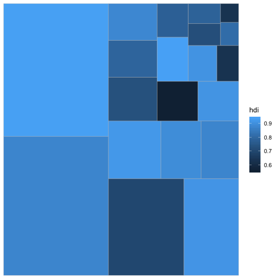
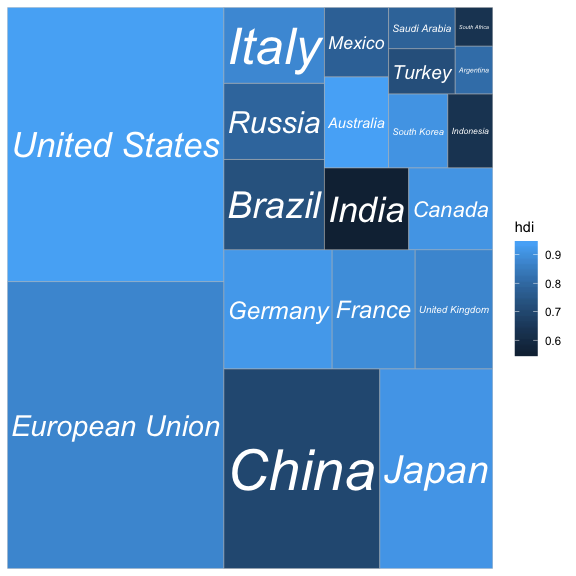

[](https://travis-ci.org/wilkox/treemapify) [](https://cran.r-project.org/package=treemapify)

**'treemapify' provides 'ggplot2' geoms for drawing [treemaps](http://en.wikipedia.org/wiki/Treemap).**

Installation
------------

Install the release version of 'treemapify' from CRAN:

`install.package("treemapify")`

If you want the development version, install it from GitHub:

`devtools::install_github("wilkox/treemapify")`

The G20 dataset
---------------

'treemapify' includes an example dataset containing statistics about the G-20 group of major world economies.

``` r
library(ggplot2)
library(treemapify)
G20
#>           region        country gdp_mil_usd   hdi econ_classification
#> 1         Africa   South Africa      384315 0.629          Developing
#> 2  North America  United States    15684750 0.937            Advanced
#> 3  North America         Canada     1819081 0.911            Advanced
#> 4  North America         Mexico     1177116 0.775          Developing
#> 5  South America         Brazil     2395968 0.730          Developing
#> 6  South America      Argentina      474954 0.811          Developing
#> 7           Asia          China     8227037 0.699          Developing
#> 8           Asia          Japan     5963969 0.912            Advanced
#> 9           Asia    South Korea     1155872 0.909            Advanced
#> 10          Asia          India     1824832 0.554          Developing
#> 11          Asia      Indonesia      878198 0.629          Developing
#> 12       Eurasia         Russia     2021960 0.788          Developing
#> 13       Eurasia         Turkey      794468 0.722          Developing
#> 14        Europe European Union    16414483 0.876            Advanced
#> 15        Europe        Germany     3400579 0.920            Advanced
#> 16        Europe         France     2608699 0.893            Advanced
#> 17        Europe United Kingdom     2440505 0.875            Advanced
#> 18        Europe          Italy     2014079 0.881            Advanced
#> 19   Middle East   Saudi Arabia      727307 0.782          Developing
#> 20       Oceania      Australia     1541797 0.938            Advanced
```

Drawing a simple treemap
------------------------

In a treemap, each tile represents a single observation, with the area of the tile proportional to a variable. Let's start by drawing a treemap with each tile representing a G-20 country. The area of the tile will be mapped to the country's GDP, and the tile's fill colour mapped to its HDI (Human Development Index). `geom_treemap` is the basic geom for this purpose.

``` r
ggplot(G20, aes(area = gdp_mil_usd, fill = hdi)) +
  geom_treemap()
```



This plot isn't very useful without the knowing what country is represented by each tile. `geom_treemap_text` can be used to add a text label to each tile. It uses the ['ggfittext'](https://github.com/wilkox/ggfittext) package to resize the text so it fits the tile. In addition to standard text formatting aesthetics you would use in `geom_text`, like `fontface` or `colour`, we can pass additional options specific for 'ggfittext'. For example, we can place the text in the centre of the tile with `place = "centre"`, and expand it to fill as much of the tile as possible with `grow = TRUE`.

``` r
ggplot(G20, aes(area = gdp_mil_usd, fill = hdi, label = country)) +
  geom_treemap() +
  geom_treemap_text(fontface = "italic", colour = "white", place = "centre",
                    grow = TRUE)
```



Subgrouping tiles
-----------------

`geom_treemap` supports subgrouping of tiles within a treemap by passing a `subgroup` aesthetic. Let's subgroup the countries by region, draw a border around each subgroup with `geom_treemap_subgroup_border`, and label each subgroup with `geom_treemap_subgroup_text`. `geom_treemap_subgroup_text` takes the same arguments for text placement and resizing as `geom_treemap_text`.

``` r
ggplot(G20, aes(area = gdp_mil_usd, fill = hdi, label = country,
                subgroup = region)) +
  geom_treemap() +
  geom_treemap_subgroup_border() +
  geom_treemap_subgroup_text(place = "centre", grow = T, alpha = 0.5, colour =
                             "black", fontface = "italic", min.size = 0) +
  geom_treemap_text(colour = "white", place = "topleft", reflow = T)
```


Note that 'Argentina' has been hidden. `geom_treemap_text` will hide text labels that cannot fit a tile without being shrunk below a minimum size, by default 4 points. This can be adjusted with the `min.size` argument.

Like any 'ggplot2' plot, 'treemapify' plots can be faceted, scaled, themed, etc.

``` r
ggplot(G20, aes(area = gdp_mil_usd, fill = region, label = country)) +
  geom_treemap() +
  geom_treemap_text(grow = T, reflow = T, colour = "black") +
  facet_wrap( ~ econ_classification) +
  scale_fill_brewer(palette = "Set1") +
  theme(legend.position = "bottom") +
  labs(
    title = "The G-20 major economies",
    caption = "The area of each country is proportional to its relative GDP
               within the economic group (advanced or developing)",
    fill = "Region"
  )
```


Animated treemaps
-----------------

The default algorithm for laying out the tiles is the 'squarified' algorithm. This tries to minimise the tiles' aspect ratios, making sure there are no long and flat or tall and skinny tiles. While 'squarified' treemaps are aesthetically pleasing, the downside is that the position of tiles within the plot area can change dramatically with even small changes to the dataset. This makes it difficult to compare treemaps side-by-side, or create animated treemaps.

By providing the `fixed = TRUE` option to 'treemapify' geoms, an alternative layout algorithm is used that will always position the tiles based on the order of observations in the data frame. It's very important that the same value for `fixed` is passed to all 'treemapify' geoms, otherwise different layers of the plot might not share the same layout.

With the help of `fixed = TRUE`, and with the [`tweenr`](https://github.com/thomasp85/tweenr) and [`gganimate`](https://github.com/dgrtwo/gganimate) packages, it becomes possible to create animated treemaps showing e.g. change over time.

``` r
library(tweenr)
library(gganimate)

G20_alt <- G20
G20_alt$gdp_mil_usd <- sample(G20$gdp_mil_usd, nrow(G20))
G20_alt$hdi <- sample(G20$hdi, nrow(G20))

tweened <- tween_states(list(G20, G20_alt, G20), tweenlength = 8,
                        statelength = 5, ease = 'cubic-in-out', nframes = 31)

animated_plot <- ggplot(tweened, aes(area = gdp_mil_usd, fill = hdi,
                                     label = country, subgroup = region,
                                     frame = .frame)) +
  geom_treemap(fixed = T) +
  geom_treemap_subgroup_border(fixed = T) +
  geom_treemap_subgroup_text(place = "centre", grow = T, alpha = 0.5,
                             colour = "black", fontface = "italic", min.size = 0,
                             fixed = T) +
  geom_treemap_text(colour = "white", place = "topleft", reflow = T, fixed = T)

animation::ani.options(interval = 1/10)
gganimate(animated_plot, "man/figures/animated_treemap.gif", title_frame = F,
          ani.width = 200, ani.height = 200)
```


